<div align="center">

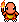
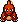
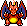

# PokeBar ⚡

### Combates Pokémon **en vivo** en la barra de menús de tu Mac

Tu Pokémon pasea, lucha contra rivales aleatorios, evoluciona… y cuando alcanza
su forma final, el entrenador lo captura y saca al siguiente.

<br>

<a href="https://github.com/amlndz/pokebar/releases/latest/download/PokeBar.zip">

</a>

<br><br>


<sub>macOS 13+ · Apple Silicon · gratis · 7 MB</sub>

<br>

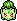
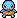
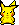
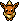
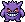
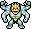
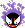
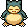
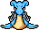
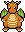
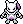

<sub><i>De Kanto a Teselia — cualquiera puede ser tu Pokémon o tu rival</i></sub>

</div>

---

## ✨ Qué hace

<table>
<tr>
<td width="50%" valign="top">

###  634 Pokémon

Cinco generaciones completas. Tu héroe puede ser cualquiera, tenga evoluciones
por delante o no.

</td>
<td width="50%" valign="top">

###  Combates aleatorios

Cada rival entra por un lado distinto y el duelo se coloca solo: nunca bajo el
notch, nunca en las esquinas.

</td>
</tr>
<tr>
<td width="50%" valign="top">

### 🔴 Despedida y captura

Antes de volver a la pokeball, tu Pokémon salta, gruñe o se echa a dormir. Luego
el entrenador lo captura y saca a otro.

</td>
<td width="50%" valign="top">

###  Ligera y discreta

Sin Dock ni ventanas. Los clics atraviesan a los Pokémon. Ocúltala o reiníciala
desde la pokeball de la barra.

</td>
</tr>
</table>

---

## 📥 Instalación

1. **[Descarga `PokeBar.zip`](https://github.com/amlndz/pokebar/releases/latest/download/PokeBar.zip)** y descomprímelo
2. Arrastra `PokeBar.app` a <kbd>Aplicaciones</kbd>
3. La primera vez: <kbd>clic derecho</kbd> → <kbd>Abrir</kbd> → <kbd>Abrir</kbd> &nbsp;<sub>(app sin notarizar)</sub>
4. Busca la pokeball 🔴 en tu barra de menús — el resto va solo

---

## 🛠️ Compilar desde el código

```sh
./build-app.sh      # genera PokeBar.app
open PokeBar.app
```

Para desarrollo rápido: `swift run PokeBar`.

---

## 📂 Estructura

| Archivo | Qué contiene |
|---|---|
| `Sources/PokeBar/AppDelegate.swift` | Director del espectáculo (máquina de fases del combate) |
| `Sources/PokeBar/BattleStage.swift` | Ventana sobre la barra + actores animados |
| `Sources/PokeBar/PokeSprites.swift` | Carga de frames y pokeball del menú |
| `Sources/PokeBar/SpeciesData.swift` | Datos de las especies y sus evoluciones |
| `Sources/PokeBar/Resources/` | Frames de los Pokémon (walk/attack/hurt, izquierda/derecha) |
| `web/` | Página de descarga |
| `tools/` | Scripts para descargar y trocear sprites |

---

<div align="center">

<sub>Sprites por <a href="https://sprites.pmdcollab.org">PMD Sprite Collab</a> · Pokémon © Nintendo / Game Freak</sub>
<br>
<sub><b>Proyecto fan sin ánimo de lucro</b></sub>

</div>
